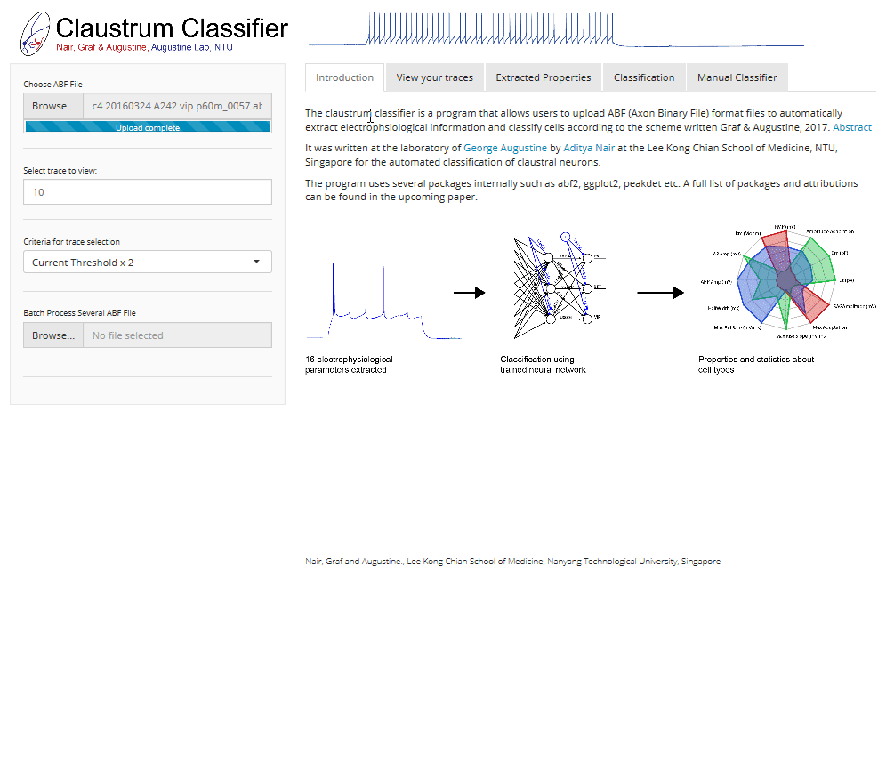

# Claustrum Classifier!    

Automated electrophysiology based classification of claustrum neurons

### Aditya Nair, Martin Graf, George Augustine<a href="#fn1" id="ref1">1</a>

The claustrum is a mysterious nucleus of the brain that regulates diverse behaviour from sleep to attention and possibly even consciousness! At the heart of such myriad behaviours might be the presence of heterogenous cell-types in the claustrum. 

The Augustine lab has recently performed an extensive classification of claustrum neurons based on intrinsic electrophysiological properties and identified at least 5 such cell-types<a href="#fn2" id="ref2">2</a>! The Claustrum Classifier allows anyone to use this scheme by providing software tools for automated extraction of cellular properties from ex-vivo electrophysiological data and classification using a trained neural net that can distinguish the cell-types identified in our publication.

## About Claustrum Classifier

Claustrum Classifier is written in the R programming language and uses the Shiny framework for its GUI. It uses several packages internally including abf2, ggplot2 and peakdet. A list of all packages can be found in [Required_Packages](Required_Packages.R). Extraction of cellular properties such as input resistance, action potential threshold are according to definitions in our recent paper<a href="#fn2" id="ref2">2</a>! and have been implemented using custom scripts. Classification is performed by feed-forward neural networks. Details of classifiers are also available in our publication.

## Using Claustrum Classifier

### Use our online webapp!

 The easiest way to use the software is at the following link as a webapp: [Claustrum Classifier](https://claustrum.shinyapps.io/online/). The GUI has been implemented to be user-friendly and intuitive: users simply need to upload their files in the ABF format and traverse different tabs to inspect their traces, examine properties and view the classification result.

### Install and use locally 

If you wish to use the software on your computer, you would first need to use the script [Required_Packages](Required_Packages.R) to install the various packages used after downloading all files from our github page. After this, simply perform `runApp('CLA_Classifier.R')` to run the GUI and select your file, view traces etc.

## License

>Claustrum Classifier is licensed through Nanyang Technological University; redistribution and use for academic and other non-commercial purposes, with or without modification, are permitted provided that conditions of the license are met

--- 
 
### For any queries, please contact [Aditya Nair](adi.nair@caltech.edu)

1. [Augustine Laboratory, Lee Kong Chian School of Medicine, Nanyang Technological University](http://www.lkcmedicine.ntu.edu.sg/aboutus/Faculty-and-Staff/Pages/George-Augustine.aspx)<a href="#ref1" title="Jump back to footnote 1 in the text.">↩</a> 

2. [Graf, Nair, Wong, Tang and Augustine, Identification of mouse claustral neuron types based on their intrinsic electrical properties, Submitted for publication](https://www.abstractsonline.com/pp8/#!/4376/presentation/33214)<a href="#ref2" title="Jump back to footnote 2 in the text.">↩</a> 
